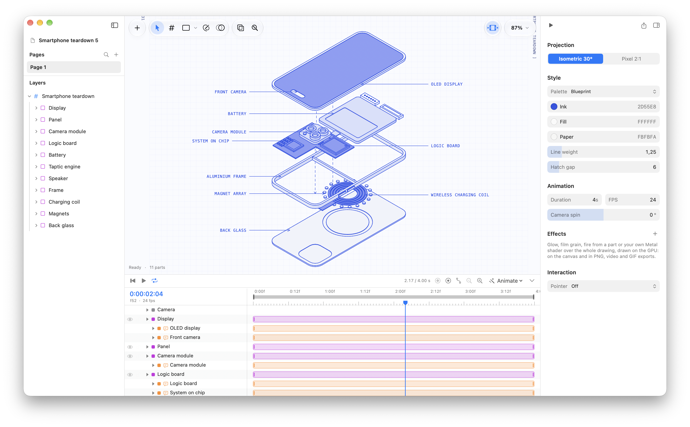

<p align="center">
  
</p>

<h1 align="center">Isometric Workbench</h1>

<p align="center">Animated exploded-view isometric blueprints for macOS.</p>

Build parts from primitives and sketches, explode them on a timeline, make them answer the pointer, and export PNG, SVG, PDF, video, GIF, Lottie or an interactive HTML figure.



## Requirements

- macOS 14 or later
- Xcode 26 or later

## Getting started

```sh
git clone git@github.com:fiqryq/isometric-workbench.git
cd isometric-workbench
open isometric-workbench.xcodeproj
```

Run the `isometric-workbench` scheme. In Debug builds, set `WORKBENCH_PRO=1` to unlock Pro without a purchase.

## Tests

```sh
cd Packages/IsoKit && swift test
```

App tests run from Xcode with ⌘U.
